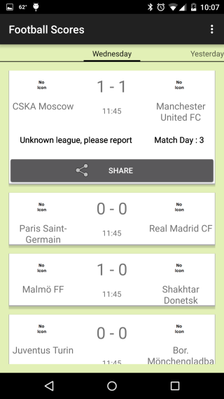
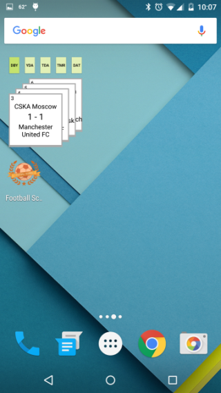

# Football Scores

##### Notes for code reviewer:

1. Please insert your own API key in strings.xml (resource name "api_key").
2. All my comments in source code are prefixed with "AlexSt".
3. Corrected names of some classes and variables to follow common convention of lowerCamelCase for variables/functions, UpperCamelCase for class names, class member names to start with 'm'.
4. Removed magic numbers throughout the code.
5. Collection widget is implemented to meet both "required" (widget) and "extra" (collection widget) criteria.
   * Collection widget replicates functionality of the main app:
     * Widget takes space of 2x2 cells and has 5 day buttons on top.
     * Tapped button is emphasized by darker color and opens up StackView of score cards for selected day.
     * Tapping on score card opens details view of the card in the main app.
6. Football Scores app has content descriptions for all buttons, images, and text.
7. Football Scores app supports layout mirroring.
8. Strings are all included in the strings.xml file and untranslatable strings have a translatable tag marked to false.

##### Screenshots:
 
